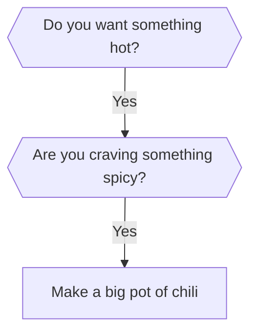

# 🔮 Decision Oracle

An interactive CLI tool for building, consulting, and visualizing binary decision trees. Grow your own knowledge trees by answering yes/no questions, then consult the Oracle whenever you're stuck on a decision.

## Features

### Core
- **🌱 Build** — Interactively grow decision trees by defining yes/no questions and leaf outcomes
- **🔮 Consult** — Walk through a tree with the Oracle to get a decision based on your answers
- **🌳 Visualize** — Render any tree as ASCII art directly in the terminal
- **📋 List** — See all saved trees with node counts, depths, and descriptions
- **📊 Export** — Generate Mermaid diagrams for rendering in Markdown or documentation
- **💾 Persistent** — Trees are saved as JSON files, persisting between sessions

### New in v2.0
- **🎲 Random Decision** — Skip the questions and let the Oracle pick a random outcome from any tree
- **📊 Statistics** — View detailed tree stats: node counts, depth, balance ratio, all possible decisions
- **✅ Validate** — Check a tree for structural issues (missing branches, empty text, excessive depth)
- **🗑️ Delete** — Remove saved trees with a confirmation prompt
- **`--version` and `--help` flags** — Standard CLI flags now supported
- **Improved ASCII tree rendering** — Fixed prefix alignment for nested branches
- **Better error handling** — Graceful handling of empty names, corrupted files, and malformed trees
- **Input sanitization** — Tree names are safely sanitized for filenames
- **Long text wrapping** — Decision text is now wrapped for readability

## How to Install

No external dependencies needed — just Python 3.10+:

```bash
# Clone or download this directory
cd decision-oracle
```

## How to Run

```bash
# Interactive menu (default)
python3 decision_oracle.py

# Or use a specific command directly:
python3 decision_oracle.py build       # Build a new decision tree
python3 decision_oracle.py consult     # Consult the Oracle
python3 decision_oracle.py visualize   # Show tree as ASCII art
python3 decision_oracle.py list        # List all saved trees
python3 decision_oracle.py export      # Export as Mermaid diagram
python3 decision_oracle.py random      # Get a random decision (skip questions!)
python3 decision_oracle.py stats        # Show tree statistics
python3 decision_oracle.py validate    # Validate a tree's structure
python3 decision_oracle.py delete       # Delete a saved tree

# CLI flags:
python3 decision_oracle.py --version   # Show version (2.0.0)
python3 decision_oracle.py --help      # Show help and available commands
```

## Usage Examples

### Building a Tree

Run `python3 decision_oracle.py build` and answer the prompts:

```
🌳  Name your decision tree: what_to_cook
📝  Brief description: Deciding what to cook for dinner

══════════════════════════════════════════════
🌱  Let's grow your decision tree!
══════════════════════════════════════════════

🌿 Enter a yes/no question: Do you have more than 30 minutes?
  ── YES branch ──
  Does YES lead to a final decision? [y/n]: n
  ❓ Enter a yes/no question: Are you comfortable with complex recipes?
    ── YES branch ──
    Does YES lead to a final decision? [y/n]: y
    ✅ Final decision/outcome for YES: Make beef bourguignon!
    ── NO branch ──
    Does NO lead to a final decision? [y/n]: y
    ❌ Final decision/outcome for NO: Simple pasta with jarred sauce.
  ── NO branch ──
  Does NO lead to a final decision? [y/n]: y
  ❌ Final decision/outcome for NO: Order pizza.
```

### Consulting the Oracle

Run `python3 decision_oracle.py consult`, pick a tree, and answer questions:

```
🔮 Consulting the Oracle of 'lunch_decider'...
"The leaves of knowledge rustle with insight..."

❓ Do you want something hot? [y/n]: y
❓ Are you craving something spicy? [y/n]: y
❓ Do you have more than 30 minutes? [y/n]: n

══════════════════════════════════════════════
🔮 The Oracle decrees:

     "Grab spicy ramen — quick, hot, and packs a punch."

Path taken: YES: Do you want something hot? → YES: Are you craving something spicy? → NO: Do you have more than 30 minutes?
══════════════════════════════════════════════
```

### Random Decision

Can't decide even with guidance? Let fate decide:

```bash
python3 decision_oracle.py random
```

The Oracle picks a random leaf from the tree — no questions asked!

```
🎲 The Oracle of 'weekend_planner' speaks without hesitation...
"The Oracle closes its eyes and points — there!"

══════════════════════════════════════════════
🔮 The Oracle randomly decrees:

     "Start that side project! Pick a repo, open your editor, and ship something."

Hypothetical path: YES: Is the weather nice? → NO: Are you feeling creative? → NO: Do you prefer making art or making code?
══════════════════════════════════════════════
```

### Viewing Statistics

```bash
python3 decision_oracle.py stats
```

Shows node counts, depth, balance ratio, and lists every possible decision with its path.

### Validating a Tree

```bash
python3 decision_oracle.py validate
```

Checks for missing branches, empty text, excessive depth, and other structural issues.

### Visualizing a Tree

Run `python3 decision_oracle.py visualize` to see the tree structure:

```
🌳 Tree: lunch_decider

  ──────────────────────────────────────────────────────
  🌳 Do you want something hot?
  ├── YES
  │ ❓ Are you craving something spicy?
  │ ├── YES
  │ │ ❓ Do you have more than 30 minutes?
  │ │ ├── YES
  │ │ │ 🔵 Make a big pot of chili — you've got time, make it count!
  │ │ └── NO
  │     🔵 Grab spicy ramen — quick, hot, and packs a punch.
  │ └── NO
  │   ❓ Are you in the mood for soup?
  │   ├── YES
  │   │ 🔵 Tomato soup with grilled cheese — comfort in a bowl.
  │   └── NO
  │     🔵 Warm panini or toasted sandwich — hot, crispy, satisfying.
  └── NO
    ❓ Are you looking for something healthy?
    ├── YES
    │ 🔵 Big hearty salad with lots of toppings — kale, nuts, avocado.
    └── NO
      ❓ Are you in a rush?
      ├── YES
      │ 🔵 Quick sandwich or wrap — fuel up and get going.
      └── NO
        🔵 Charcuterie board — assemble meats, cheeses, crackers, and graze.
  ──────────────────────────────────────────────────────
  Nodes: 15 | Leaves: 8 | Depth: 3
```

### Exporting a Mermaid Diagram

Run `python3 decision_oracle.py export` to generate a Mermaid flowchart:



## Included Sample Trees

The `trees/` directory includes two sample trees to get you started:

| Tree | Description | Nodes | Decisions | Depth |
|------|-------------|-------|-----------|-------|
| `lunch_decider` | Can't decide what to eat? Let the Oracle guide your lunch decisions. | 15 | 8 | 3 |
| `weekend_planner` | Not sure what to do this weekend? The Oracle knows. | 15 | 8 | 3 |

## How It Works

Decision Oracle uses a binary tree structure where each internal node contains a yes/no question and each leaf node contains a final decision. The tree is stored as a nested JSON object:

```json
{
  "question": "Do you want something hot?",
  "yes": {
    "question": "Are you craving something spicy?",
    "yes": { "decision": "Spicy ramen!" },
    "no": { "decision": "Tomato soup with grilled cheese." }
  },
  "no": {
    "question": "Are you looking for something healthy?",
    "yes": { "decision": "Big salad." },
    "no": { "decision": "Charcuterie board." }
  }
}
```

Trees of any depth are supported — keep branching until you've captured all the nuances of a decision.

## Running Tests

```bash
python3 -m pytest test_decision_oracle.py -v
```

The test suite covers node counting, leaf collection, tree depth calculation, validation, Mermaid export, path sanitization, JSON persistence, and CLI flags.

## License

Public domain — use it however you like!