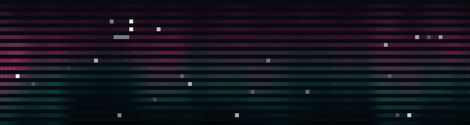

# Terminal Aurora Borealis Simulator

A self-contained Python program that paints a procedurally-animated aurora
borealis across your terminal — drifting curtains of light, a twinkling
starfield, a phased moon, occasional shooting stars, a snow-capped mountain
silhouette, and a rippling lake that mirrors the lights. No external
dependencies, no assets — everything is generated from value noise and
mathematics at runtime.



## Features

### Visuals

- **Procedural curtains** — four layered value-noise curtains with different
  frequencies, speeds, and phases produce organic, ever-changing ribbons of
  light. A 2D noise field adds vertical "ray" streaks that flicker through the
  bands.
- **Six color palettes** — `green` (classic northern lights), `violet`
  (magnetic purple), `sunset` (warm corona), `rainbow` (full spectral), `ice`
  (cool blue-white), and `magnetic` (solar-storm pink/teal). Cycle between
  them live with `c`.
- **Twinkling starfield** — dozens of stars with per-star brightness and
  twinkle phase sit behind the aurora.
- **Phased moon** — a moon with a randomized phase (new, crescent, quarter,
  gibbous, full) is drawn in the upper sky using a terminator model. Toggle
  with `m`.
- **Shooting stars (meteors)** — occasional meteors streak diagonally across
  the sky with fading tails. They spawn rarely for a calm feel and are
  disabled in reduced-motion mode. Toggle with `s`.
- **Mountain silhouette** — a procedurally generated ridge with snow caps on
  the taller peaks sits in the foreground. Toggle with `t`.
- **Lake reflection** — the bottom rows are treated as still water, mirroring
  the aurora's glow with a gentle ripple and depth fade so it reads as water
  rather than a copy of the sky. Toggle with `l`.
- **Truecolor rendering** — 24-bit ANSI escape codes drive the colors; the
  character ramp ` .:-=+*#%@` controls density, so the image reads even on
  terminals without truecolor support.

### Interaction & accessibility

- **Reduced-motion mode** (`r`) — slows the animation, disables star twinkle,
  and suppresses shooting stars for a calmer, accessibility-friendly view.
- **Live toggles** — moon, stars, lake, mountains, palette, speed, and pause
  can all be flipped while running.
- **Resize-aware** — detects terminal resize and regenerates the starfield,
  mountains, and moon to fit.
- **Snapshot mode** (`--once`) — renders a single frame and exits, perfect for
  screenshots, piping, or CI smoke tests. Auto-enabled when stdout is not a
  TTY.
- **Forced canvas size** (`--width`/`--height`) — override the detected
  terminal size for deterministic screenshots or CI.
- **No dependencies** — runs on the Python 3.10+ standard library alone.

## Install

No installation step is required. Just clone the repo and run the script:

```bash
git clone <this-repo>
cd 2026-07-26-terminal-aurora-simulator
python3 aurora.py
```

Requires Python 3.10+ (uses `str | None` type hints, so 3.10 is the practical
floor). Works best in a terminal that supports 24-bit truecolor (most modern
terminals: GNOME Terminal, Kitty, WezTerm, iTerm2, Alacritty, Windows
Terminal).

## How to run

```bash
# default interactive animation
python3 aurora.py

# pick a starting palette
python3 aurora.py --palette violet

# seed it for a reproducible scene
python3 aurora.py --seed 1337 --palette rainbow

# render a single frame (great for screenshots / piping to a file)
python3 aurora.py --once --seed 42 --palette magnetic

# force a specific canvas size (handy for CI / deterministic screenshots)
python3 aurora.py --once --seed 42 --width 120 --height 32 > frame.ans

# run for 10 seconds then exit (non-interactive, for cron / demos)
python3 aurora.py --duration 10 --non-interactive

# start in reduced-motion mode
python3 aurora.py --reduced-motion

# custom animation speed
python3 aurora.py --speed 2.0

# start with the moon and lake hidden
python3 aurora.py --no-moon --no-lake

# list available palettes
python3 aurora.py --list-palettes

# show the version
python3 aurora.py --version
```

### CLI flags

| Flag                | Default | Description                                                |
|---------------------|---------|------------------------------------------------------------|
| `--palette`         | green   | Initial palette: green, violet, sunset, rainbow, ice, magnetic |
| `--speed`           | 1.0     | Initial animation speed multiplier                          |
| `--seed`            | time    | Random seed for reproducible scenes                         |
| `--fps`             | 24      | Target frames per second                                    |
| `--duration`        | 0       | Run for N seconds then exit (0 = forever)                    |
| `--reduced-motion`  | off     | Start in reduced-motion mode                                |
| `--non-interactive` | off     | Do not read keyboard input                                  |
| `--once`            | off     | Render a single frame and exit (auto-set when not a TTY)    |
| `--width`           | tty     | Force canvas width in columns                               |
| `--height`          | tty     | Force canvas height in rows                                 |
| `--no-moon`         | off     | Hide the moon                                               |
| `--no-stars`        | off     | Hide the starfield and shooting stars                       |
| `--no-mountains`    | off     | Hide the mountain silhouette                                |
| `--no-lake`         | off     | Hide the lake reflection                                     |
| `--list-palettes`   | off     | Print the available palettes and exit                       |
| `--version`         | —       | Print the version and exit                                  |

## Controls (interactive mode)

| Key        | Action                              |
|------------|-------------------------------------|
| `q` / Esc  | Quit                                |
| `+` / `=`  | Speed up                            |
| `-` / `_`  | Slow down                           |
| `r`        | Toggle reduced-motion mode          |
| `c`        | Cycle to next color palette         |
| `m`        | Toggle the moon                     |
| `s`        | Toggle stars & shooting stars       |
| `l`        | Toggle lake reflection              |
| `t`        | Toggle mountains                    |
| `h`        | Toggle the help overlay             |
| `space`    | Pause / resume                      |
| Ctrl-C     | Quit                                |

## Usage examples

Capture a still frame to a text file (ANSI codes included):

```bash
python3 aurora.py --once --seed 42 --palette violet > frame.txt
less -R frame.txt   # -R lets less render the colors
```

Run a 30-second non-interactive demo on a projector:

```bash
python3 aurora.py --duration 30 --non-interactive --palette rainbow --speed 1.3
```

A calm, aurora-only meditation scene (no moon, no stars, no lake):

```bash
python3 aurora.py --no-moon --no-stars --no-lake --palette ice
```

Generate a fresh SVG screenshot for the README:

```bash
python3 make_screenshot.py > screenshot.svg
```

Run the test suite to verify the renderer:

```bash
python3 test_smoke.py
```

## How it works

1. **Value noise.** A fixed-size grid of random values is sampled with
   smoothstep interpolation to produce 1D and 2D value noise. Fractal noise
   (a sum of octaves with decreasing amplitude) gives the curtains their
   natural-looking variation. Degenerate (empty) grids return `0.0` instead
   of crashing.
2. **Curtains.** For each screen column, four layered noise functions — each
   with its own frequency, speed, phase, brightness, and color contribution
   — are summed into a column intensity and a color coordinate `t`.
3. **Vertical profile.** A Gaussian falloff centered on a band in the upper
   sky, shifted by the column intensity, concentrates the light into a
   ribbon. A 2D noise field multiplies through as "ray" streaks.
4. **Color.** The column's `t` value is blended with the vertical position and
   the streak noise, then looked up in the active palette's gradient stops
   to produce a 24-bit RGB color. Intensity darkens the color and selects the
   character from the ramp. The bottom-of-band color per column is also
   captured for the lake reflection.
5. **Stars.** A scatter of stars with per-star brightness and twinkle phase
   is rendered first; the aurora overwrites them where it is bright.
6. **Moon.** A disk is drawn at a random sky position; a cosine-terminator
   model decides which cells are lit vs. dark, giving a phase shape from new
   to full.
7. **Shooting stars.** With low probability per frame, a meteor is spawned
   near the top of the sky with a diagonal velocity and a finite lifetime.
   Each frame the positions advance and the lifetimes decay; the tail fades
   along its length.
8. **Mountains.** A sum of sine-like noise ridges produces a silhouette; tall
   peaks get snow caps.
9. **Lake.** The bottom two rows are treated as water. For each column, the
   captured bottom-of-band aurora color is painted with a depth fade and a
   slow sine ripple, with `~` characters marking the water surface.
10. **Compositing.** Each row is emitted as a run of characters, only
    switching the ANSI color escape when the color actually changes, keeping
    the output stream compact.

## Files

- `aurora.py` — the simulator (single file, stdlib only).
- `make_screenshot.py` — imports the real `aurora` renderer and emits an SVG
  screenshot for the README.
- `test_smoke.py` — a smoke + regression test suite that exercises every
  palette, the resize path, the key handler, the new feature toggles
  (moon, stars, lake, mountains), shooting-star spawn/decay, and edge cases
  (empty noise grids, speed clamping, tiny/huge terminals, negative seeds).

## License

MIT — do whatever you like.